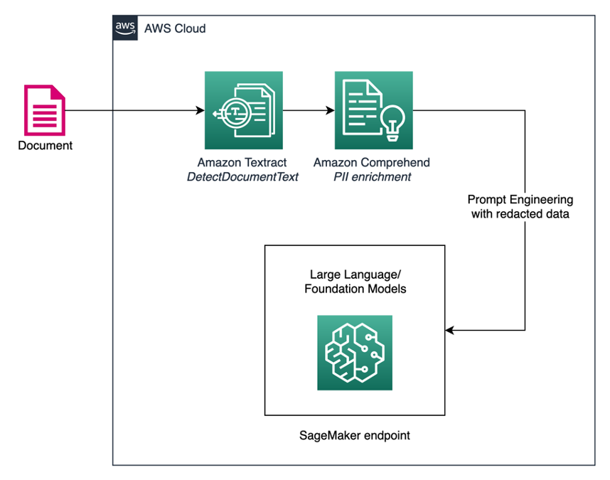

# Welcome to Conversation with Documents 📄💬

The IDP-GenAI app features a bunch of examples on how you can have conversation with LLMs augmented with AWS AI Services in your document processing workflows.


## Installation

Open a terminal and run:

```bash
$ pip install streamlit
```

## Prerequisites

When deploying this app locally, you need to add a file called ```secrets.toml``` in a folder called ```.streamlit``` at the root of the app repo, and copy/paste your AWS Credentials as secrets into that file. AWS Credentials allow you to authenticate and authorize your requests when you interact with AWS Services like Amazon Textract, Amazon Comprehend, etc. Further instructions are available in the Streamlit library [Secrets management documentation](https://docs.streamlit.io/library/advanced-features/secrets-management).


## Quickstart

This app is a multipage app where the "entrypoint file" is the first page the app will show to the users. You can think of the entrypoint file as the app's "main page". Here, the entrypoint file is ```Home.py```. The command to run this multipage app is:

```bash
$ cd streamlit-docker
$ streamlit run Home.py
```

Let's review the directory structure for the IDP-GenAI app:

```bash
Home.py # This is the file you run with "streamlit run"
└─── pages/
  └─── Financial Services.py # This is a page showcasing Financial Services use case.
  └─── Healthcare.py # This is a page showcasing Healthcare use case which is still WIP.
└─── utils/
  └─── model_interface.py # LLM endpoints.
  └─── textract_interface.py # Textract and Comprehend.
└─── static/ # Image files used in the demo.
```

## Architecture Overview

The IDP-GenAI app is built with Streamlit, that lets you turn data scripts into shareable web apps in minutes. It leverages AWS AI/ML Services like Amazon Textract, Amazon Comprehend, and Amazon SageMaker. Here is a high-level architecture diagram of the workflow:


